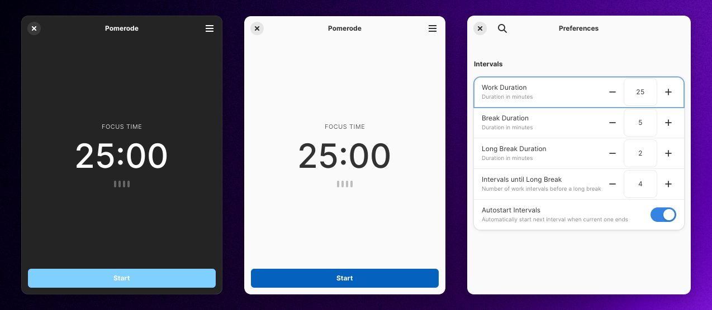

# Pomerode

A simple focus timer app.

<div align="center">
  
</div>

## 🚀 Features

- Clean and modern interface
- Customizable work and break durations
- Visual session tracking
- Smart break transitions
- System notifications
- Autostart sessions option

## ⚡️ Requirements

- elementary OS 7.0 or later
- GTK 4.0 or later
- libadwaita 1.0 or later

## 🏗 Building From Source

You'll need the following dependencies:
```bash
sudo apt install elementary-sdk meson ninja-build libgtk-4-dev libadwaita-1-dev
```

Clone the repository and build:
```bash
git clone https://github.com/sammarxz/pomerode.git
cd pomerode
meson build --prefix=/usr
cd build
ninja
```

To install:
```bash
sudo ninja install
```

## 🎯 Using Pomerode

1. Launch Pomerode
2. Click "Start" to begin your focus session
3. Work until the timer ends
4. Take a break when notified
5. Repeat!

## ⚙️ Customization

You can customize:
- Work duration (1-60 minutes)
- Break duration (1-30 minutes)
- Long break duration (1-60 minutes)
- Number of sessions before long break
- Auto-start preference

Access these settings through the menu > Preferences.

## 📝 Credits

- Built with [elementary OS](https://elementary.io)
- Uses [GTK4](https://gtk.org) and [libadwaita](https://gnome.pages.gitlab.gnome.org/libadwaita/)

## 📄 License

GNU General Public License v3.0
